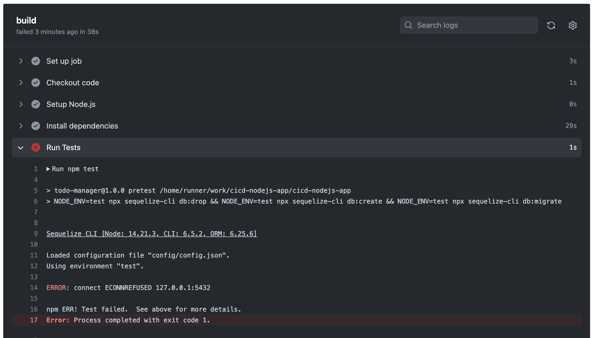

In this lesson, you will learn more about automated testing and how we can integrate it with our CICD pipeline. So, let's get started.

Automated testing is a process of using certain software tools and scripts to execute some pre-defined tests on an application or software system. These tests are designed to check various aspects of the application's functionality, performance, and reliability.

Automated testing is a fundamental pillar of the CI/CD pipeline, as it  
- detects bugs and issues in application at an early stage
- ensures code quality
- reduces risk associated with deploying unverified code changes to production.

You can learn more about the importance of automated testing in CICD pipeline, using the following links:

#### Resource 1: https://semaphoreci.com/blog/automated-testing-cicd
This article explains the importance and benefits of automated testing in CI/CD, such as faster feedback, higher quality, and lower risk. It also provides some tips and best practices on how to design, write, and maintain automated tests that are reliable, maintainable, and scalable.

#### Resource 2: https://www.lambdatest.com/blog/automation-testing-in-ci-cd-pipeline/
This article gives a comprehensive overview of what CI/CD pipeline is and how it works. It also shows how to integrate automated testing into the CI/CD pipeline using tools like LambdaTest, Jenkins, and Selenium. 

Now, let me show you, how we've integrated automated tests in our CICD pipeline. Here I'm using a Node.Js application and configuring CICD pipeline in it using Github Actions.

> Action: Open repo in Github.
Now, here I've two workflows, `ci.yml` and `deploy.yml` inside the `.github/workflows` folder. To run automated tests in our repository, I've updated the ci.yml file like this:
```yml
name: Node.js CI

on:
  push:
    branches:
      - main  # Adjust this to your main branch name

jobs:
  build:
    runs-on: ubuntu-latest
    
    steps:
    - name: Checkout code
      uses: actions/checkout@v2

    - name: Setup Node.js
      uses: actions/setup-node@v2
      with:
        node-version: '14'  # Change to your desired Node.js version
        
    - name: Install dependencies
      run: npm install
      
    - name: Run Tests
      run: npm test      
```
The last command would run all tests that we've written inside our Node.Js application.

It's as simple as that. Now to test if it's working properly, let's push some code to the main branch.

> Action: Make some changes in the main branch and show the workflow in action inside the `Actions` tab.

> In case of failure:
So, as you can see, the our test cases are running successfully, some of them are failing which we can fix in our app.


> In case of success:
So, as you can see, the our test cases are running successfully. That's great.

So, that's it for this lesson, see you in the next one.