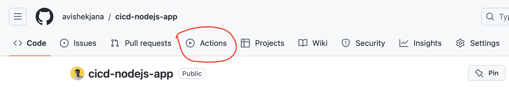

# Script
In this lesson, I'll show you how we've configured GitHub Actions for Continuous Integration and Continuous Deployment (CI/CD). We will demonstrate how we've configured a workflow in a GitHub repository using GitHub Actions, which automatically runs on certain events. Here we are using a Node.Js project that uses Sequelize to connect with a PostgreSQL database.

Now, if you want to know the fundamentals of CI/CD, then you can refer to the following links:

#### Resource 1: https://resources.github.com/ci-cd/
This article introduces the fundamentals of CI/CD and how it can help us achieve faster development, stability, reliability, and business growth. 

#### Resource 2: https://www.digitalocean.com/community/tutorials/an-introduction-to-ci-cd-best-practices
This article explains the basic concepts and benefits of CI/CD, such as faster feedback, higher quality, and lower risk. It also provides some guidance on how to implement and maintain a CI/CD system.

#### Resource 3: https://github.blog/2022-02-02-build-ci-cd-pipeline-github-actions-four-steps/
This article will help us to build a CI/CD pipeline with GitHub Actions in four simple steps, for any project.

So, let's walk through the steps that we've gone through to set up a basic CI/CD pipeline using GitHub Actions:

### Step 1: Setting up the GitHub Repository
First we've pushed our Node.Js application to a new GitHub repository.

### Step 2: Creating a CI Workflow in GitHub
In this step, in the **Actions** tab of our GitHub repository, we've created a new workflow.

> Action: Visit the Actions tab of the github repo.

Here, the workflow file have the following contents:
```yaml
# ci.yml

name: Node.js CI/CD pipeline

on:
  push:
    branches:
      - main  # Adjust this to your main branch name

jobs:
  build:
    runs-on: ubuntu-latest
    
    steps:
    - name: Checkout code
      uses: actions/checkout@v2

    - name: Setup Node.js
      uses: actions/setup-node@v2
      with:
        node-version: '14'  # Change to your desired Node.js version
        
    - name: Install dependencies
      run: npm install
      
```
Now, this simple workflow sets up a CI pipeline that triggers on pushes to the `main` branch, then it checks out the code, installs Node.js and finally installs all project dependencies.

You will find this workflow file inside the `.github/workflows/` folder of our repository.
> Action: Show the actual file path.

### Step 3: Configure Deployment Workflow
Next, we've configured another workflow file called `deploy.yml`, for the deployment workflow.
```yaml
on:
  push:
    branches:
      - main
  workflow_dispatch:
  
jobs:
  run_pull:
    name: run pull
    runs-on: self-hosted
    
    steps:
    - name: install ssh keys
      run: |
        install -m 600 -D /dev/null ~/.ssh/id_rsa
        echo "${{ secrets.SSH_PRIVATE_KEY }}" > ~/.ssh/id_rsa
        ssh-keyscan -H ${{ secrets.SSH_HOST }} > ~/.ssh/known_hosts
    - name: connect and pull
      run: ssh ${{ secrets.SSH_USER }}@${{ secrets.SSH_HOST }} "cd /home/user/cicd-nodejs-app && git checkout main && git pull origin main && export NVM_DIR=~/.nvm && source ~/.nvm/nvm.sh && ./setup.sh && exit"
```
In this workflow,
- We've used some environment variables like: `SSH_PRIVATE_KEY`, `SSH_USER`, `SSH_HOST`, which we've defined in GitHub repository's secrets.
- It will use these environment variables to SSH into the server and deploy the latest changes in `main` branch.

### Step 4: Configure repository secrets
In the previous step, we've used some secrets like: `SSH_PRIVATE_KEY`, `SSH_USER`, `SSH_HOST`. We've defined them inside the repository's **Settings** > **Secrets and variables** > **Actions**.

And that's it. It's as simple as that. Now to test these two workflows, let's push some code to the `main` branch.
> Action: Make some changes in the main branch and show the workflow in action inside the Actions tab.

So as you can see, the CICD workflows are working seamlessly, as expected.

So, that's it for this lesson, see you in the next one.


