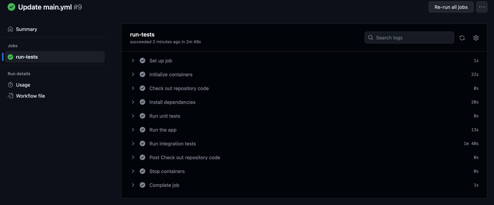
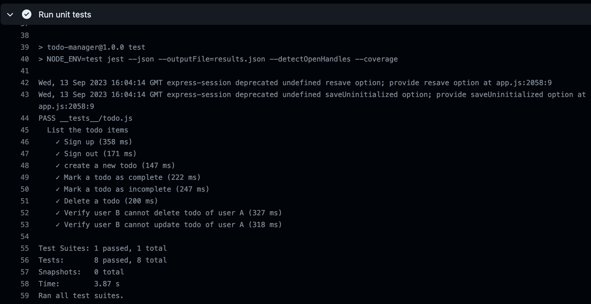
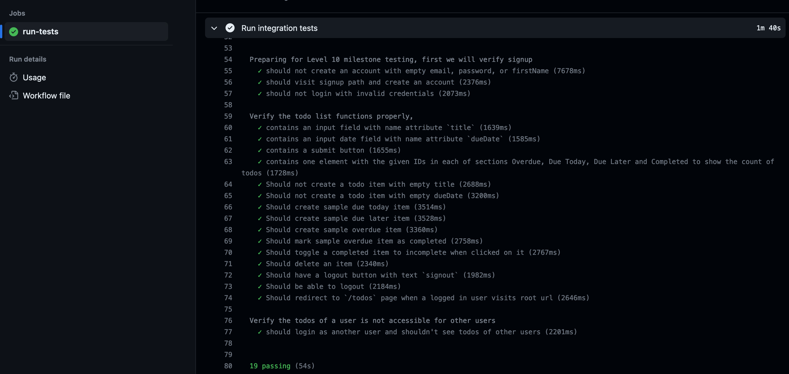

## Script

In this lesson, we will make use of all the concepts that we learnt in this level and add those to our existing Node.js project.

On completing this level, you will have:

- Unit tests configured using Jest
- Integration tests configured using Cypress
- Have configured GitHub actions to run automatically when a new code is pushed.

## Screenshots

You should have something similar in GitHub actions:

There should be unit tests:

And integration tests as well.

